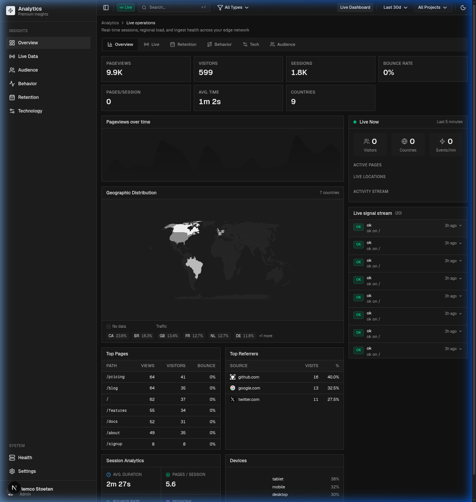

# Remco Analytics

Premium, first-party analytics platform with centralized ingestion, dedicated SDK, and a high-performance dashboard. Cookie-free, privacy-first, and self-hosted on Neon Postgres.

[](https://opensource.org/licenses/MIT)
[](https://www.typescriptlang.org/)
[](https://www.npmjs.com/package/@remcostoeten/analytics)
[](https://remcostoeten-analytics-demo.vercel.app)

[Live Demo](https://remcostoeten-analytics-demo.vercel.app) | [NPM Package](https://www.npmjs.com/package/@remcostoeten/analytics)



## Packages

| Package | Purpose | Tech |
| :--- | :--- | :--- |
| `apps/example-dashboard` | Modern analytics UI with ⌘K command palette | Next.js 16.2, React 19, Recharts |
| `apps/ingestion` | High-throughput Hono ingestion service | Hono, Zod, Vercel Edge |
| `packages/sdk` | Client-side tracking library (@remcostoeten/analytics) | TypeScript, Fetch/Beacon API |
| `apps/ingestion/src/db` | Database schema and client | Neon Postgres, Drizzle ORM |

## Tech Stack

- **Framework:** Next.js 16.2 (Turbopack), React 19
- **Database:** Neon Postgres (Serverless)
- **ORM:** Drizzle
- **Styling:** Vanilla CSS, Lucide Icons
- **Runtime:** Bun
- **Hosting:** Vercel

## Installation (Ingestion Service)

The ingestion service is the core entry point for all tracking events.

```bash
# Clone and install
git clone https://github.com/remcostoeten/analytics.git
cd analytics
bun install

# Configure environment
cp .env.example .env
# Set DATABASE_URL and IP_HASH_SECRET (min 32 chars)

# Setup Database
cd apps/ingestion
bun run db:push

# Start Ingestion
cd ../../apps/ingestion
bun run dev
```

## Ingestion Contract

- `GET /health` - Service health monitor
- `POST /ingest` - Accepts event payloads (validated via Zod)
  - Bot detection (40+ patterns)
  - Geo-extraction (headers)
  - Secure IP hashing (no raw IP storage)

## Hosting

### 1. Database (Neon)
Create a project on [Neon.tech](https://neon.tech) and get your `DATABASE_URL`.

### 2. Dashboard & Ingestion (Vercel)
Both `apps/example-dashboard` and `apps/ingestion` are designed for Vercel deployment.

```bash
# Deploy Dashboard
cd apps/example-dashboard
vercel --prod

# Deploy Ingestion
cd apps/ingestion
vercel --prod
```

### Required Environment Variables
| Variable | Description |
| :--- | :--- |
| `DATABASE_URL` | Neon Postgres connection string |
| `IP_HASH_SECRET` | Secret key for hashing visitor IP addresses |

## SDK Quick Start

```bash
bun add @remcostoeten/analytics
```

```tsx
import { Analytics } from '@remcostoeten/analytics'

export default function App() {
  return (
    <>
      <Component />
      <Analytics projectId="my-app" ingestUrl="https://analytics.yourdomain.com/api/ingest" />
    </>
  )
}
```

---
MIT © Remco Stoeten