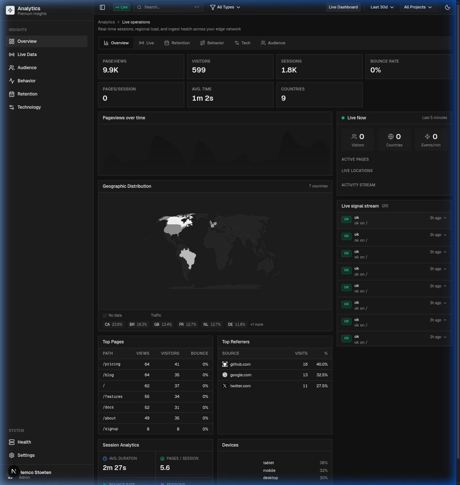

# Remco Analytics

First-party analytics you self-host. Cookie-free, privacy-first, built for Next.js and React. Install the SDK in your app, deploy the ingestion service against your own Postgres, and optionally run the dashboard on the same database.

[](https://opensource.org/licenses/MIT)
[](https://www.typescriptlang.org/)
[](https://www.npmjs.com/package/@remcostoeten/analytics)
[](#sdk-identity-and-privacy)
[](#sdk-identity-and-privacy)
[](#deployment-model)
[](https://remcostoeten-analytics-demo.vercel.app)

[Live Demo](https://remcostoeten-analytics-demo.vercel.app) · [NPM Package](https://www.npmjs.com/package/@remcostoeten/analytics) · [Roadmap](docs/consumer/roadmap.md)



---

## Quick start

### Option A — Scaffold (recommended)

```bash
npx create-analytics my-app --tier separate --yes
```

Creates `apps/web` (SDK only) + `apps/analytics-api` (ingestion). See generated `README.md`.

### Option B — Manual

1. Create a [Neon](https://neon.tech) Postgres database
2. Deploy `apps/ingestion` with `DATABASE_URL` + `IP_HASH_SECRET`
3. Run migrations: `cd packages/ingestion && bun run db:migrate`
4. In your app: `npm install @remcostoeten/analytics`
5. Set `NEXT_PUBLIC_ANALYTICS_URL` to your ingestion **base URL**
6. Add `<Analytics projectId="your-project" />` to your root layout
7. Call `trackEvent(...)` in client components where needed
8. Optionally call `trackServerEvent(...)` from API routes for server-only events
9. Optionally deploy `apps/example-dashboard` with the same `DATABASE_URL`

```bash
npm install @remcostoeten/analytics
```

```tsx
// app/layout.tsx
import { Analytics } from "@remcostoeten/analytics";

export default function RootLayout({ children }) {
  return (
    <html lang="en">
      <body>
        {children}
        <Analytics projectId="my-app" />
      </body>
    </html>
  );
}
```

```bash
# .env.local
NEXT_PUBLIC_ANALYTICS_URL=https://analytics-api.yourdomain.com
```

The SDK posts to `{ingestUrl}/e`. Use the base host — not a path suffix.

---

## Deployment model

Remco Analytics has three parts. Only the SDK is on npm.

| Part | Install | Who hosts |
| --- | --- | --- |
| SDK (`@remcostoeten/analytics`) | `npm install @remcostoeten/analytics` | Runs in the browser |
| Ingestion (`apps/ingestion`) | Clone repo, deploy yourself | You (Vercel, Bun, Node) |
| Dashboard (`apps/example-dashboard`) | Clone repo, deploy yourself | You (optional) |

```
Your app (Next.js / React)
  └─ npm: @remcostoeten/analytics
       └─ POST events → Your ingestion URL

Your ingestion service (self-hosted)
  └─ DATABASE_URL → Your Neon Postgres
  └─ IP_HASH_SECRET → Required in production

Your dashboard (optional, self-hosted)
  └─ DATABASE_URL → Same Neon Postgres
```

You do **not** need the dashboard to collect data. Ingestion + SDK is enough. The dashboard is a separate UI that reads from the same database.

### Environment variables

**Ingestion**

| Variable | Required | Purpose |
| --- | --- | --- |
| `DATABASE_URL` | Yes | Neon Postgres connection string |
| `IP_HASH_SECRET` | Yes in production (min 32 chars) | Daily-rotating salt for IP hashing |
| `ORIGIN_ALLOWLIST` | No | Comma-separated allowed origins (empty = all) |
| `INGEST_SECRET` | No | Bearer token for server-side events via `@remcostoeten/analytics/server` |
| `INTERNAL_IP_HASHES` | No | IP hashes flagged as internal traffic |

**SDK**

| Variable | Required | Purpose |
| --- | --- | --- |
| `NEXT_PUBLIC_ANALYTICS_URL` | Yes (Next.js) | Base URL of your ingestion service |
| `VITE_ANALYTICS_URL` | Yes (Vite) | Same, for Vite apps |
| `ANALYTICS_URL` | For server tracking | Same base URL, server-only (not `NEXT_PUBLIC_`) |
| `INGEST_SECRET` | For server tracking | Same value as on ingestion; never expose to the browser |

```bash
# Correct
NEXT_PUBLIC_ANALYTICS_URL=https://analytics-api.yourdomain.com

# Wrong — SDK will POST to https://.../ingest/e
NEXT_PUBLIC_ANALYTICS_URL=https://analytics-api.yourdomain.com/ingest
```

**Dashboard (optional)**

| Variable | Required | Purpose |
| --- | --- | --- |
| `DATABASE_URL` | Yes | Same database as ingestion |

### Deploy ingestion and dashboard

```bash
git clone https://github.com/remcostoeten/analytics.git
cd analytics && bun install

cd apps/ingestion
bun run db:migrate
bun run dev          # local
vercel --prod        # production

cd ../example-dashboard
vercel --prod        # optional
```

---

## SDK: automatic tracking

Drop `<Analytics />` in your root layout. It renders nothing and starts four observers on mount.

```tsx
<Analytics
  projectId="my-app"
  ingestUrl="https://analytics-api.yourdomain.com"
  disabled={false}
  debug={false}
/>
```

| Prop | Default | Effect |
| --- | --- | --- |
| `projectId` | `window.location.hostname` | Separates traffic in the database |
| `ingestUrl` | env var | Override ingestion base URL |
| `disabled` | `false` | When true, no observers start |
| `debug` | `false` | Log tracking decisions to console |

### What gets tracked automatically

| Signal | Event `type` | `meta.eventName` | When it fires |
| --- | --- | --- | --- |
| Page views | `pageview` | — | Initial load + SPA route changes |
| Web Vitals | `event` | `web-vitals` | Page hide / beforeunload (TTFB, FCP, LCP, CLS, INP) |
| Scroll depth | `event` | `scroll` | beforeunload or cleanup (`depth`: 0–100) |
| Time on page | `event` | `time-on-page` | beforeunload or cleanup (`timeOnPageMs`) |

SPA navigation is handled by patching `history.pushState` / `replaceState` and listening to `popstate`.

---

## SDK: manual tracking

All functions are client-only. They no-op during SSR, when the user opted out, or when DNT is enabled.

```tsx
import {
  track,
  trackPageView,
  trackEvent,
  trackClick,
  trackError,
  trackTransaction,
  trackSearch,
  identifyUser,
  setExperiment,
} from "@remcostoeten/analytics";
```

| Function | Event `type` | Purpose |
| --- | --- | --- |
| `track(type, meta?, options?)` | any string | Low-level escape hatch |
| `trackPageView(meta?, options?)` | `pageview` | Explicit pageview |
| `trackEvent(name, meta?, options?)` | `event` | Custom event |
| `trackClick(elementName, meta?, options?)` | `click` | Named click |
| `trackError(error, meta?, options?)` | `error` | Error with message + stack |
| `trackTransaction(revenue, currency?, orderId?, items?, options?)` | `event` | Revenue tracking |
| `trackSearch(query, resultCount, options?)` | `event` | Site search |
| `identifyUser(properties, options?)` | `event` | User traits |
| `setExperiment(experimentId, variantId, options?)` | `event` | A/B exposure |

Each call accepts optional `options`: `{ projectId?, ingestUrl?, debug? }`.

### Payload shape

Every track call sends:

```typescript
{
  type: string,
  projectId: string,
  path: string,
  referrer: string | null,
  origin: string,
  host: string,
  ua: string,
  lang: string,
  visitorId: string,
  sessionId: string,
  meta?: {
    screenSize?: string,
    viewport?: string,
    pixelRatio?: number,
    utmSource?: string,
    utmMedium?: string,
    utmCampaign?: string,
    utmContent?: string,
    utmTerm?: string,
    connectionType?: string | null,
    connectionDownlink?: number | null,
    eventName?: string,
    ...
  }
}
```

Auto-enrichment (screen, viewport, UTM, connection) is merged into your `meta` on every call. Delivery uses `navigator.sendBeacon` with `fetch` + `keepalive` fallback. Duplicate events within 5 seconds are dropped client-side.

---

## SDK: server tracking

For events that only happen on your backend (API routes, webhooks, cron jobs). Import from `@remcostoeten/analytics/server` — not the main package.

```typescript
import { trackServerEvent } from "@remcostoeten/analytics/server";

await trackServerEvent("signup_completed", {
  projectId: "my-app",
  path: "/api/signup",
});
```

Set `ANALYTICS_URL` and `INGEST_SECRET` in server env (same secret on ingestion). Browser SDK stays unchanged — no secret in client code.

| Function | Purpose |
| --- | --- |
| `trackServerEvent(name, options)` | Custom server event |
| `trackServerEvent(name, meta, options)` | Custom server event with metadata |
| `trackServer(type, options, meta?)` | Low-level |
| `trackServerError(error, options)` | Server-side error |
| `createServerTrack(defaults)` | Bind `projectId` once per file |

See [packages/sdk/README.md](./packages/sdk/README.md) for full examples.

---

## SDK: standalone observers

Use without `<Analytics />` for custom wiring or non-React apps.

```tsx
import {
  observePageViews,
  observePerformance,
  observeScroll,
  observeTimeOnPage,
} from "@remcostoeten/analytics";

const cleanup = observePageViews({ projectId: "my-app", ingestUrl: "..." });
cleanup();
```

Each returns an unsubscribe function. Mix and match — pageviews only, skip web vitals, etc.

---

## SDK: identity and privacy

```tsx
import {
  getVisitorId,
  resetVisitorId,
  getSessionId,
  resetSessionId,
  extendSession,
  optOut,
  optIn,
  isOptedOut,
  checkDoNotTrack,
} from "@remcostoeten/analytics";
```

| API | Storage | Behavior |
| --- | --- | --- |
| `getVisitorId()` | `localStorage` | Persistent across sessions |
| `resetVisitorId()` | `localStorage` | New UUID |
| `getSessionId()` | `sessionStorage` | 30-minute inactivity timeout |
| `resetSessionId()` | `sessionStorage` | New session UUID |
| `extendSession()` | `sessionStorage` | Refresh the 30-minute timeout |
| `optOut()` | `localStorage` | Disables tracking, removes visitor ID |
| `optIn()` | `localStorage` | Re-enables tracking |
| `isOptedOut()` | — | Returns opt-out state |
| `checkDoNotTrack()` | — | True when browser DNT is enabled |

No HTTP cookies. DNT and opt-out are respected automatically.

---

## Ingestion service

When the SDK POSTs to `/e` (or `/ingest`), ingestion:

1. Validates payload with Zod
2. Detects bots (40+ UA patterns)
3. Extracts geo from request headers
4. Hashes IP address (never stores raw IP)
5. Classifies device, browser, OS from UA
6. Deduplicates in-memory (per serverless instance)
7. Rate-limits by IP hash
8. Upserts visitor record
9. Inserts event into Postgres

| Method | Path | Purpose |
| --- | --- | --- |
| GET | `/health` | Health check |
| POST | `/e` | Ingest event (SDK default) |
| POST | `/ingest` | Ingest event (alias) |
| GET | `/metrics` | Request metrics |
| GET | `/admin/stats` | Admin statistics |
| POST | `/admin/cleanup` | Data retention cleanup |
| GET | `/events` | SSE live stream (dev-oriented) |

On Vercel serverless, in-memory rate limiting and deduplication only apply within a single function instance. Schedule an external cron for `/admin/cleanup`.

---

## Dashboard (optional)

The example dashboard reads from the same `events` and `visitors` tables. Built-in support for these SDK event names:

| `meta.eventName` | Dashboard usage |
| --- | --- |
| `time-on-page` | Avg time on page, session stats |
| `web-vitals` | TTFB, FCP, LCP, CLS, INP |
| `scroll` | Engagement metrics |
| `transaction` | Revenue KPIs |
| `site_search` | Search analytics |
| `identify` | User properties |
| `experiment_exposure` | A/B test data |

Custom `trackEvent("anything")` calls are stored and queryable in recent events.

---

## Monorepo layout

| Path | Purpose |
| --- | --- |
| `packages/sdk` | `@remcostoeten/analytics` npm package |
| `packages/ingestion` | `@remcostoeten/ingestion` npm package (publishable) |
| `apps/ingestion` | Thin Vercel deploy shell for ingestion |
| `apps/example` | Minimal Next.js consumer app (all three tracking patterns) |
| `apps/example-dashboard` | Next.js analytics UI |

**Stack:** TypeScript, Bun, Neon Postgres, Drizzle ORM, Hono, Next.js, React.

---

MIT © Remco Stoeten
