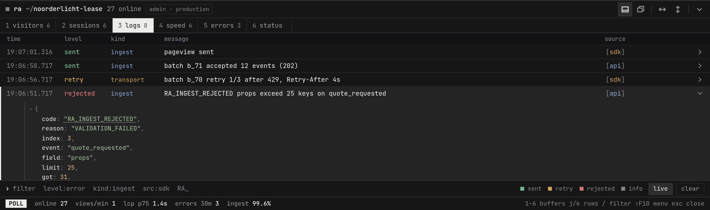

<h1 align="center">Analytics</h1>

<p align="center">Self-hosted, privacy-first web analytics: a browser and server SDK, an API for ingest and reads, and a dashboard, on your own Postgres.</p>

<p align="center">
  
  
  
  
  
  
</p>

<p align="center">
  
</p>

You add the SDK to a site, it sends pageviews, custom events, errors and speed metrics to an API you run, and the data lands in your own Postgres database. Visitors get no cookies and raw IP addresses are never stored.

Version 2 is being rebuilt in this repository. The API runs at `api.analytics.remcostoeten.nl` and the docs at [docs.analytics.remcostoeten.nl](https://docs.analytics.remcostoeten.nl). The v2 dashboard is not built yet; the version 1 that still runs in production lives in [`v1/`](v1/README.md).

- **[`@spoar/sdk`](packages/sdk/README.md)** sends typed events from the browser, the server, React and Next, batches requests and adds features through plugins.
- **[`@spoar/devtools`](packages/devtools/README.md)** is an overlay panel for admins on their own site: online visitors, sessions, a live log stream, speed per route and error groups.
- `apps/api` is one Elysia API for ingest, reads and sign-in, built on the engine in `packages/engine`.
- Bots are scored and filtered at ingest, and stored events can be rescored later.
- [`examples/`](examples/README.md) holds small apps that use the SDK, one per stack.

The plan, API reference and schemas are in [`docs/v2/`](docs/v2/README.md).

## Install

Both packages publish prereleases under the `next` tag until 2.0.0.

```bash
npm install @spoar/sdk@next
npm install @spoar/devtools@next
```

## Development

Requires Bun 1.3.

```bash
bun install          # install every workspace
bun run check        # typecheck, lint, format check, boundaries, deps, knip and tests
bun run test         # run all tests
bun run --cwd apps/docs dev   # docs site on port 3200
```

How the repo is organised and how work is done is in [AGENTS.md](AGENTS.md).

<br/>

xxx,<br/>
[Remco Stoeten](https://remcostoeten.com)<br/>
<small>MIT</small>
