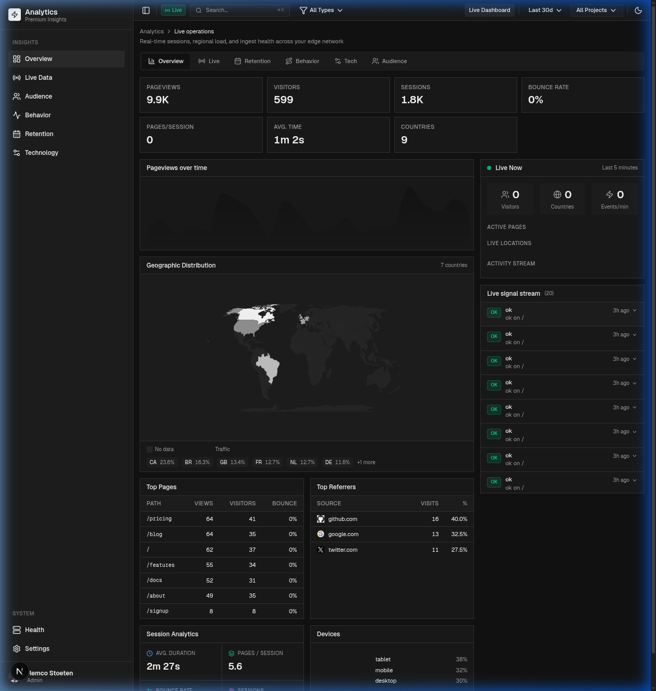

<h1 align="center">Analytics v1</h1>

The first version of Remco's self-hosted, cookie-free web analytics. It is frozen and still runs in production.

<p align="center">
  
</p>

v1 has three parts: a browser and server SDK that sends events, an ingestion service that validates, enriches and stores them in Postgres, and a Next.js dashboard that reads the same database directly. There is no read API. v2 is being rebuilt at the repo root and is not deployed yet; until it replaces this, v1 gets fixes only and no new features.

- **Production dashboard** at [v1.analytics.remcostoeten.nl](https://v1.analytics.remcostoeten.nl).
- Ingestion at `https://ingestion.remcostoeten.nl`, a Hono app on Vercel behind Cloudflare.
- The SDK is published to npm as [`@remcostoeten/analytics`](https://www.npmjs.com/package/@remcostoeten/analytics) 1.x.
- Raw IP addresses are never stored; they are hashed with a salt that rotates daily.
- Visitors get no cookies. The SDK keeps its ids in `localStorage` and `sessionStorage`.

The full architecture, ingest pipeline, routes and schema are in [AGENTS.md](AGENTS.md).

## Where it runs

| Part | Source | Deployed to |
| --- | --- | --- |
| Dashboard | `apps/dashboard` | Vercel project `v1.analytics`, served at v1.analytics.remcostoeten.nl |
| Ingestion | `apps/ingestion` (deploy shell) and `packages/ingestion` (the service) | Vercel project `ingestion`, served at ingestion.remcostoeten.nl behind Cloudflare |
| SDK | `packages/sdk` | npm, `@remcostoeten/analytics` |
| Database | `packages/ingestion/src/db` | Neon Postgres, shared by ingestion and dashboard |

Both Vercel projects build from `master`. Ingestion's build (`apps/ingestion/vercel.json`) builds `packages/ingestion`, then `apps/ingestion/scripts/build.ts` bundles it into one Node function and ships the MaxMind GeoLite2 City and ASN databases with it. The same file schedules two Vercel crons: `/admin/rollup` daily at 02:30 UTC and `/admin/cleanup` at 03:00 UTC.

There is no release script for the npm packages. Bump the version, build and run `npm publish` by hand from `packages/sdk` or `packages/ingestion`.

## Setup

Requires Bun 1.3 and, for the demo database, Docker. Commands run from the repo root, which holds the Bun workspace for both v1 and v2.

```bash
git clone https://github.com/remcostoeten/analytics.git
cd analytics
bun install
bun run --filter './v1/packages/*' build
```

The apps consume `packages/sdk` and `packages/ingestion` through their built `dist`, so rebuild them after changing their source.

### Environment

Ingestion reads `v1/apps/ingestion/.env` (Bun loads it on `dev`). The dashboard reads `v1/apps/dashboard/.env.local`.

**Ingestion**

| Variable | Required | Purpose |
| --- | --- | --- |
| `DATABASE_URL` | Yes | Neon Postgres connection string. Without it, ingestion stores nothing and reports every event as deduped |
| `IP_HASH_SECRET` | Yes in production | Salt for IP hashing, at least 32 characters. Production refuses every request without it. Generate with `openssl rand -hex 32` |
| `ORIGIN_ALLOWLIST` | No | Comma-separated allowed origins. Empty allows all |
| `INGEST_SECRET` | No | Bearer token for server-side events from `@remcostoeten/analytics/server` |
| `ADMIN_SECRET`, `CRON_SECRET` | For admin routes and crons | Accepted as `x-admin-secret` or `Authorization: Bearer` |
| `INTERNAL_IPS`, `INTERNAL_VISITOR_IDS` | No | Comma lists that mark your own traffic as internal |
| `GEOIP_MMDB_PATH`, `GEOIP_ASN_MMDB_PATH` | No | Paths to the GeoLite2 City and ASN files. Default is `GeoLite2-City.mmdb` and `GeoLite2-ASN.mmdb` in the working directory; geo is skipped when they are missing |

**Dashboard**

| Variable | Required | Purpose |
| --- | --- | --- |
| `DATABASE_URL` | Yes | The same database as ingestion |
| `GITHUB_CLIENT_ID`, `GITHUB_CLIENT_SECRET` | In production | GitHub OAuth app. When both are set, sign-in is required and only GitHub logins in the `dashboard_users` table get in. Unset, the dashboard is open |
| `AUTH_SECRET` | No | Session cookie key. Defaults to `GITHUB_CLIENT_SECRET` |
| `NEXT_PUBLIC_ANALYTICS_URL` | No | Where the dashboard tracks its own visits. Defaults to `https://ingestion.remcostoeten.nl` |
| `POSTHOG_API_KEY`, `POSTHOG_PROJECTS`, `POSTHOG_HOST` | No | Enables the PostHog tab |

The OAuth callback URL is `https://<dashboard host>/api/auth/callback`. Add a user with:

```sql
INSERT INTO dashboard_users (github_login) VALUES ('your-github-username');
```

### Database

Migrations live in `packages/ingestion/src/db/migrations` as hand-written, idempotent SQL. `db:migrate` does not apply them, so run them in order against Neon with `psql`:

```bash
for f in v1/packages/ingestion/src/db/migrations/0*.sql; do psql "$DATABASE_URL" -f "$f"; done
```

A schema change updates `schema.ts`, adds the next numbered migration, and updates the test DDL in `packages/ingestion/tests/setup.ts`.

### Run it locally

```bash
bun run demo:v1:db          # local Postgres with about 90 days of seeded data
bun run dev:v1              # dashboard on http://localhost:3000
bun run dev:v1:ingestion    # ingestion on port 3000, or the next free port
```

`demo:v1:db` runs Postgres 16 on port 5434 and a Neon HTTP proxy on port 4444 through Docker, applies every migration and seeds the data. It then offers to point `apps/dashboard/.env.local` at the demo database, keeping your own `DATABASE_URL` so it can be restored, and to start the dashboard. Pass `-- --force` to reseed, `-- --use-demo` to switch without the prompt and `-- --restore` to switch back. More in [scripts/demo-db/README.md](scripts/demo-db/README.md).

### Tests and checks

```bash
bun run --filter './v1/**' test    # v1 tests: ingestion unit and integration (PGlite), SDK, dashboard
bun run typecheck                  # tsgo --noEmit for every workspace
bun run lint:v1                    # Oxlint with v1's own config
```

The dashboard also has a Playwright skeleton check, `bun run --cwd v1/apps/dashboard test:skeleton`. CI runs all of this, together with the v2 checks, on every pull request.

<br/>

xxx,<br/>
[Remco Stoeten](https://remcostoeten.com)<br/>
<small>MIT</small>
